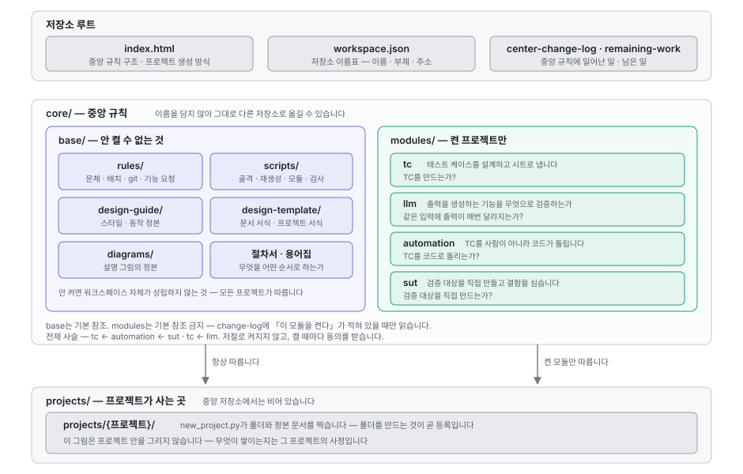

# rsj-centralized-control

기획자·개발자와 함께 진행하는 앱 프로젝트를 한 저장소에서 정리하는 워크스페이스입니다.
UI 기획과 디자인, 앱 워크플로우 전체, QA 테스트 케이스, 그리고 특정 재현 환경(OS·기기·개발 사양)에서의
예외 처리까지를 **하나의 기능 골격 아래에 묶어** 관리합니다.

한 번 만들고 끝나는 산출물이 아니라, 기능이 바뀔 때마다 골격을 갱신하고 그 이력을 추적하는
**살아있는 자산**으로 운영합니다. 이 저장소의 구조 자체가 그 운영 방식을 보여주도록 설계했습니다.

> **저장소는 둘입니다.** 이 저장소(중앙)에는 규칙과 도구만 있고 `projects/`는 비어 있습니다.
> 프로젝트는 이 저장소를 **fork해서** 진행하고, 그 과정에서 자란 규칙만 PR로 돌려보냅니다.
> 중앙에 남은 일은 [center-remaining-work.md](center-remaining-work.md)에 있습니다.

## 일하는 방식

**레퍼런스 조사에서 시작하지 않습니다.** 기획자·개발자와 직접 진행하므로 함께 정한 것이 곧 확정
사양이고, 작업은 `spec/`에서 시작합니다. 조사가 필요한 사람을 위해 `analysis/`·`reference/` 자리는
남겨 두었습니다.

세 가지를 한 골격 아래에 둡니다.

1. **UI 기획과 앱 워크플로우** — 화면 정의와 전체 흐름을 `spec/design/`에 확정 사양으로 둡니다
   (`ui-` · `flow-` 접두). 확인되지 않은 값은 추측으로 채우지 않고 `?`로 남겨 실측 대상으로 관리합니다.
2. **환경별 기대값** — OS·기기·개발 사양으로 동작이 갈리는 지점을 `spec/design/`의 `env-` 문서에
   확정합니다. 실측 관찰은 `analysis/`, 재현된 결함은 `test-case/`로 갈라 둡니다 — 확정값과 관찰값을
   한 파일에 섞으면 어느 쪽인지 매번 되짚어야 합니다.
3. **테스트 케이스** — 확정된 골격의 노드를 정상·경계·예외·우회로 전개해 실행용 TC 시트(xlsx)로 냅니다.
   **기대값은 `spec/`에서만 가져옵니다.**

각 단계 사이에는 **확인 게이트**가 있습니다. 문서를 쓰기 전에 아웃라인과 템플릿을 먼저 확인받고,
**기능 골격이 최종 확정되기 전에는 TC 설계로 넘어가지 않습니다.** 골격이 흔들린 채 TC를 쓰면
그 뒤의 모든 산출물을 다시 만들어야 하기 때문입니다.

## 구조

관계는 세 종류로 묶여 있습니다. **절차 기준**(`doc-playbook`·`rules/`)은 특정 산출물이 아니라
모든 작업 전에 확인하는 규칙이고, **형식 기준**(`master css·html`·`template-catalog`)은 중앙 허브부터
프로젝트 문서까지 모든 HTML 산출물의 형식을 결정하며, **TC 생성 도구**(tc 모듈의 `design-template/`·`scripts/`)는
TC 엑셀 하나를 만들어 냅니다. 마지막 묶음은 폴더 위치가 서로 다르지만 역할이 한 쌍이라 함께 묶었습니다.

이 그림은 **무엇이 어디 있는가**를 말합니다. **무엇을 근거로 판정하는가**는 그림을 나눠
프로젝트 허브의 「검증 로직」 절에 두었습니다 — 커버리지 3축 대조 · 결함 주입 매트릭스 ·
자동화 실행과 격리. 정본은 [`core/base/diagrams/`](core/base/diagrams/)이며 허브 생성기가 읽어 넣습니다.

## 폴더 구조

최상위 구성은 아래와 같습니다. 각 폴더를 펼치면 안에 무엇이 들어 있는지 볼 수 있습니다.

- [`README.md`](README.md) — 저장소 소개 (이 문서)
- [`CLAUDE.md`](CLAUDE.md) — 작업 규칙 진입점. 정본 관리·참조 규칙·git 규칙이 여기 명문화되어 있습니다
- `index.html` — 중앙 규칙 구조와 프로젝트 생성 방식. 처음 온 사람이 읽는 진입점이며, 생성기가 만듭니다

<a href="core/base/design-guide/"><code>core/base/design-guide/</code></a> — 디자인 일관성의 기준

- [`design-guide-master.css`](core/base/design-guide/design-guide-master.css) — 색·타이포·컴포넌트 스타일의 정본
- [`design-guide-master.html`](core/base/design-guide/design-guide-master.html) — 그 스타일이 실제로 어떻게 보이는지 확인하는 시각 규칙서 ([렌더링 보기](https://ryuseojin.github.io/rsj-centralized-control/core/base/design-guide/design-guide-master.html))

새 디자인 요소가 필요하면 마스터를 임의로 고치지 않고, 판별 절차를 거쳐 버전을 올리는 방식으로만 추가합니다.

<a href="core/base/design-template/"><code>core/base/design-template/</code></a> — 문서 서식과 판별 기준

- [`template-catalog.md`](core/base/design-template/template-catalog.md) — **고르는 법**의 정본. 판별 기준·Case A/B/C·템플릿 공통 규칙이 여기 있고, 목록은 base 것만 담습니다
- `NN-{템플릿명}.html` — 문서 종류별 서식(기능 골격 트리·역분석·기획서 분석 등). 다룰 문서가 늘면 이 자리에 더해집니다

켠 모듈이 템플릿을 더합니다. 모듈에 `design-template/`이 있으면 그 카탈로그도 함께 봅니다 — 여기에 모듈 이름을 적지 않는 것은 `core/base/`만 떼어냈을 때 없는 파일을 가리키지 않기 위해서입니다.

<a href="core/modules/tc/design-template/"><code>core/modules/tc/design-template/</code></a> — tc 모듈이 더하는 서식

- [`tc-template-catalog.md`](core/modules/tc/design-template/tc-template-catalog.md) — tc를 켠 프로젝트에만 있는 것의 목록. 고르는 법은 base 카탈로그가 정본입니다
- [`tc-sheet-master.xlsx`](core/modules/tc/design-template/tc-sheet-master.xlsx) — TC 시트 기준 서식. 내부 '명세서' 시트가 작성 규칙의 정본입니다
- [`tc-input-master.json`](core/modules/tc/design-template/tc-input-master.json) — TC 설계 입력의 빈 골격(전 프로젝트 공용). 프로젝트는 이 파일을 복사해 채우고, xlsx는 거기서 생성됩니다
- [`xlsx-design-guide.md`](core/modules/tc/design-template/xlsx-design-guide.md) — xlsx 산출물이 **어떻게 보이는가**의 정본. 컬럼·구조 규칙은 `rules/tc-sheet-format.md`가 맡습니다

<a href="core/base/"><code>core/base/</code></a> — 모든 작업이 따르는 절차·방법론

- [`doc-playbook.md`](core/base/doc-playbook.md) — 분석 → 골격 → TC 파이프라인 절차서. 확인 게이트와 체크리스트가 여기 있습니다
- [`dictionary.md`](core/base/dictionary.md) — 중앙 용어집. 정의를 새로 쓰지 않고 정본 문서를 가리키는 색인입니다
- [`rules/`](core/base/rules/) — 방법론·운영 규칙의 정의. 주제마다 파일이 갈려 있습니다 — 기능을
  어디까지 쪼갤지, 무엇을 통과라고 부를지, 기능 하나를 몇 갈래로 펼칠지, 케이스 사이의 선행 관계,
  TC 시트 서식, HTML 문서 디자인, 문서 문체, 사이트 배치, 남은 작업 운영, SUT·자동화, git 운영
- [`scripts/`](core/base/scripts/) — 정본에서 산출물을 찍어내는 도구. 골격 정본(md)을 구조 데이터로
  바꾸고, TC xlsx와 읽는 HTML을 생성하며, 문체를 정규화하고, 커버리지 3축과 결함 주입 매트릭스를
  대조합니다. **손으로 만드는 산출물을 남기지 않기 위한 층**이라 산출물이 늘면 도구도 함께 늡니다

<a href="projects/"><code>projects/{프로젝트}/</code></a> — 프로젝트별 산출물

프로젝트가 생기면 아래 구성으로 만들어집니다.

- `{프로젝트}-dictionary.md` — 프로젝트 용어집 **정본** (고유명사 허용). 읽는 문서는 `docs/`에 있습니다
- `{프로젝트}-change-log.md` — 문서 변경 이력. 작업 전 항상 먼저 읽는 파일
- `{프로젝트}-remaining-work.md` — **남은 작업의 정본.** 다음 작업 큐·결정 대기·백로그가 여기 있고, 끝난 항목은 지웁니다(완료 기록은 change-log가 맡습니다)
- `analysis/` — 조사 전량. 기본 절차는 아니며, 조사·실측이 필요할 때 원자료를 버리지 않고 모으는 곳
- `reference/` — 채택분. analysis에서 쓰기로 고른 것들의 구체 사양만 추린 자료집. 조사를 하지 않으면 비어 있습니다
- `spec/` — 확정 결정. TC의 기대값은 여기서만 가져옵니다. **폴더 이름이 곧 참조 규칙입니다**
  - `{프로젝트}-feature-tree.md` — 평면에 두는 기획 골격 **정본.** 손으로 고치는 유일한 파일
  - `design/` — 기획 확정 사양. UI 화면 정의(`ui-`)·앱 워크플로우(`flow-`)·환경별 기대값(`env-`) 세 갈래를 파일명 접두로 가릅니다. 기획 TC의 기대값은 평면의 트리와 여기에서만 옵니다
  - `sut-design/` — SUT 전용 사양(세이브 스키마·mock 응답·결함 주입). SUT를 만드는 프로젝트에만 있고, 기획 TC는 여기를 보지 않습니다
  - `rationale/` — 레퍼런스에 없어 직접 세운 노드와 직접 정한 수치의 근거. 확정안이 아니라 기대값으로 쓰지 않습니다
  - `archive/` — 지나간 상태. 골격 변경 이력(`{프로젝트}-tree-change-log.md`)과 큰 개정 직전의 동결 스냅샷이 함께 있고, 평소에는 열지 않습니다
- `test-case/` — TC 설계 입력(json 정본)과 산출된 엑셀 (기준 골격 버전 기록 + 이슈 관리 시트 내장)
- `docs/` — 문서에 싣는 이미지·GIF
- `sut/` — 테스트 대상. 대상을 직접 만드는 프로젝트에만 둡니다
- `automation/` — 자동화. `tests/`에 테스트 코드, `result/`에 실행 결과를 두며 `sut/`가 있는 프로젝트에만 둡니다

## 왜 이렇게 설계했나

**단일 정본, 나머지는 파생.** 골격이 여러 파일에 따로 살면 수정 누락으로 반드시 어긋나기 때문에,
손으로 고치는 파일을 `spec/{프로젝트}-feature-tree.md` 하나로 고정했습니다. 트리 시각화 HTML과
TC xlsx는 전부 이 정본에서 재생성됩니다.

**구조도도 하나의 이미지로 관리합니다.** 구조도는 이 README와 소개 페이지 두 곳에서 쓰이는데,
HTML 산출물은 자기완결 단일 파일 규칙 때문에 파일을 참조하지 못하고 마크업을 직접 품어야 합니다.
손으로 맞추면 한쪽만 고쳤을 때 두 그림이 갈라지면서도 아무 에러가 나지 않아 오래 발견되지 않으므로,
**사본을 아예 두지 않습니다** — `structure.svg`가 정본이고, 그림을 싣는 페이지의 생성기가 만들 때마다
그 파일을 읽어 넣습니다. 그래서 두 곳의 구조도는 항상 같은 이미지입니다.

**change-log 이원화.** 삭제·수정된 옛 기능 정보가 현재 작업에 섞여 들어오지 않도록, 문서 이력
(`{프로젝트}-change-log.md`)과 골격 이력(`spec/archive/{프로젝트}-tree-change-log.md`)을 분리했습니다.
참조 규칙이 정반대인 두 기록을 한 파일에 두면 격리가 불가능하기 때문입니다. 그래서 문서 이력은 작업 전
항상 읽고, 골격 이력은 특정 기능의 행방을 물을 때만 엽니다.

**TC 시트 규칙의 이중화.** 시트 작성 규칙을 한 곳에서만 관리하면 잘못 수정됐을 때 설계 전체가
틀어지므로, md 문서(`rules/tc-sheet-format.md`)와 기준 xlsx의 '명세서' 시트 양쪽에 두고 교차 검증합니다.
불일치가 발견되면 임의로 판단하지 않고 어느 쪽을 기준으로 삼을지 확인합니다.

나머지 설계 결정 (archive · 이슈 시트 · 용어집 · 골격 재사용 · 디자인 갱신)

**archive/ 동결 스냅샷.** TC 시트에는 "기준 골격 v1.0"이 기록되는데 정본은 계속 진화합니다.
과거 TC를 검토하거나 롤백을 판단할 때 그 시점 골격 전체를 파일 하나로 대조할 수 있어야 하므로,
큰 개정 직전의 정본을 통째로 동결해 둡니다.

**`spec/` 하위를 참조 규칙으로 갈랐습니다.** 파일마다 열어도 되는지를 외우면 실수로 옛 정보를 끌어오게
되므로, 규칙이 같은 것끼리 폴더로 묶었습니다. 골격 이력과 동결 스냅샷은 둘 다 지나간 상태라
`archive/`에 모으고, 수시로 읽어야 하는 근거 문서는 `rationale/`로 분리했습니다. 그래서 `spec/`
아래에서는 폴더 이름만 보고 참조 여부를 판단할 수 있습니다.

**이슈 관리 시트 내장.** 실무 정석은 JIRA 같은 트래커를 분리해 운영하는 것이지만, 이 저장소는
포트폴리오 열람 편의를 위해 TC와 이슈 흐름을 한 파일에서 볼 수 있도록 xlsx 안에 이슈 관리 시트를
내장했습니다.

**용어집 이원화.** 워크스페이스 전반의 용어와 프로젝트 고유명사가 한곳에 섞이면 다른 프로젝트에서 재사용할 수
없으므로, 중앙(`dictionary.md`)과 프로젝트별(`{프로젝트}-dictionary.html`)로 분리했습니다.
중앙 용어집은 정의를 새로 쓰지 않는 색인이라 정의 중복과 어긋남도 함께 차단됩니다.

**골격 재사용, 시드 파일 없음.** 프로젝트 사이에 공유 파일을 두면 한쪽 수정이 다른 쪽을 오염시키므로,
새 프로젝트는 기존 골격에서 필요한 부분만 복사해 시작하고 복사된 순간부터 완전히 독립됩니다.

**디자인은 승인 갱신만.** 문서가 늘어도 디자인이 일관되도록, 새 디자인 요소는 템플릿 카탈로그의
판별 절차(Case A/B/C)를 거쳐 마스터를 버전 갱신하는 방식으로만 추가합니다.

## 방법론 핵심

- **검증유형이 기능 목록보다 먼저.** LLM이 응답을 만드는 서비스는 "기대 결과가 단일하다"는
  TC의 전제가 깨지므로, 결정적/확률적/루브릭/금칙 네 갈래로 먼저 나눕니다.
- **TN은 케이스 안의 스텝 번호.** 케이스 사이의 선행 관계는 별개 층위(TC 관계도)로 다룹니다.
- **상태는 Depth가 아니라 Pre-Condition으로.** 로그인·구독·플랫폼을 계층으로 쪼개면 트리가
  폭발합니다.
- **추측으로 기대값을 채우지 않습니다.** 미확인 값은 `?`로 남기고 실측으로만 확정합니다.
- **커버리지는 세 축으로 대조합니다.** 기능 단위 · 화면 요소 · 게이팅 상태. 한 축만 보면 반대쪽이
  통째로 샙니다 — 기능 단위만 보면 빈 상태 안내가 빠지고, 요소만 보면 집계·격리처럼 화면에 드러나지
  않는 규칙이 빠집니다.
- **결함을 일부러 심어 탐지력을 증명합니다.** 담당 TC만 깨지는지 봅니다. 담당인데 통과하면 결함이
  아니라 그 TC가 부실한 것입니다.
- **판단은 낡으므로 기계가 검사하게 둡니다.** 검증 제외 사유, 결함의 담당 TC, 생성된 산출물이
  최신인지 — 셋 다 「나중에 다시 보자」가 아니라 실행 시점 검사입니다.

자세한 규칙은 [`core/base/doc-playbook.md`](core/base/doc-playbook.md)와
[`core/base/rules/`](core/base/rules/)에서 시작하세요.
